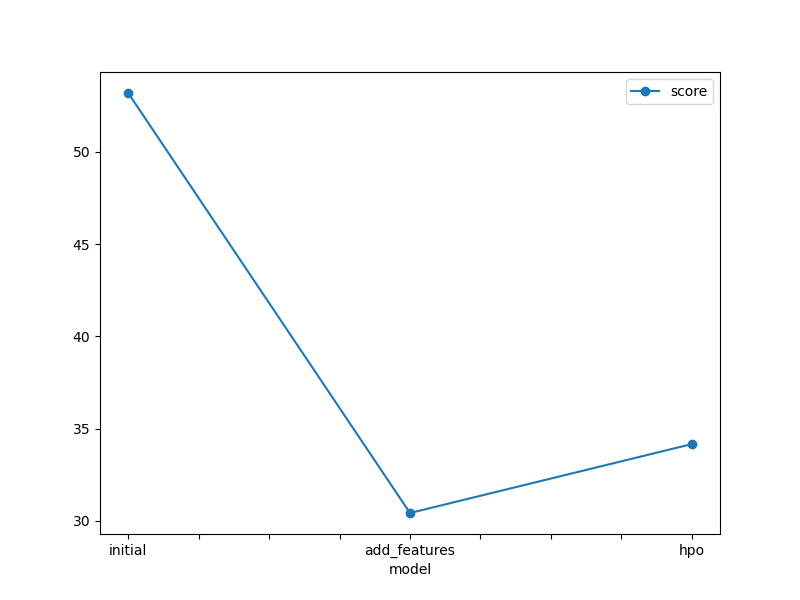
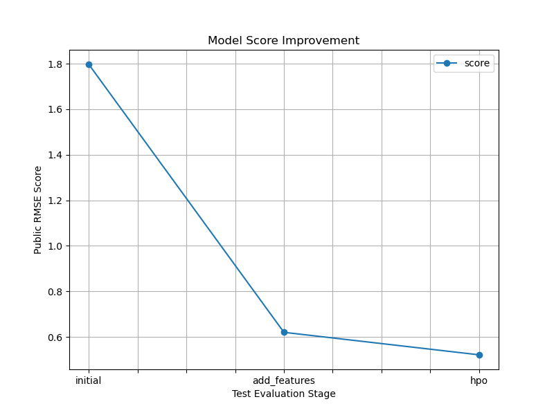

# Report: Predict Bike Sharing Demand with AutoGluon Solution
#### Name: Riwa El Kari

## Initial Training
### What did you realize when you tried to submit your predictions? What changes were needed to the output of the predictor to submit your results?
Basically the predictions from the models were floats, so they were sometimes negative, but they should be positive. Therfore, before submitting they should be changed (for example put negatives= zero)

### What was the top ranked model that performed?
For me, the top ranked model is the one after hyperparameter tuning. In particular, the best model in hyperparameter tuning was WeightedEnsemble_L2.

## Exploratory data analysis and feature creation
### What did the exploratory analysis find and how did you add additional features?
From the chart to visualize the datetime column, it seems that bike rentals rise and fall in a regular seasonal cycle where some months have much higher demand, others much lower.
So for features, I pulled out the month from the full date so the model can learn those seasonal highs and lows.
I also split the dates into day of week and hour of day, since we know usage patterns differ on weekends versus weekdays and at rush‐hour versus off‐peak.
Finally, I made sure each of these new time fields (and the existing season/weather columns) was marked as a category so the model treats, say, “March” or “Friday” as distinct values rather than raw numbers.
I also made season and weather as categories instead of numbers.

### How much better did your model perform after adding additional features and why do you think that is?
After adding the month, day-of-week, and hour features, the public RMSE dropped from 1.797 down to 0.620. This is an amazing improvement!
I think it got so much better because those new time-based features let the model directly learn which months are busy or slow (seasonality), the difference between weekdays and weekends, and morning/evening rush-hour spikes versus off-peak times
Without them, the model only saw a raw timestamp. With them, it could pick up on those nice patterns much more easily.

## Hyper parameter tuning
### How much better did your model perform after trying different hyper parameters?
After tuning the GBM and CatBoost hyperparameters, the public RMSE fell from 0.620 down to 0.521 (a small improvement)
I believe this happened because by searching different learning rates, tree sizes, and iteration counts, the models could better adapt to the data’s structure and capture patterns they were missing before instead of relying on the default settings.

### If you were given more time with this dataset, where do you think you would spend more time?
Spend more time on EDA and fully understanding the data.
Use weather forecasts instead of just past weather, so the model knows what tomorrow’s conditions will be.
Play with hyperparameter settings more—tweak how the model learns to find even better defaults.
Try a few different models to see if anything beats the ones I’ve already used.

### Create a table with the models you ran, the hyperparameters modified, and the kaggle score.

|model| hpo1(learning\_rate)| hpo2(num\_leaves)| hpo3 (iterations) | core|
| ----- |---------|---------|---------|---------|
|initial| default  | default | default | 1.79737 |
| add_features | default | default| default| 0.62008 |
| hpo| \[0.01, 0.05, 0.1]    | \[31, 63]  | \[200, 500] | 0.52121 |

### Create a line plot showing the top model score for the three (or more) training runs during the project.

### Create a line plot showing the top kaggle score for the three (or more) prediction submissions during the project.

## Summary
We used AutoGluon to predict hourly bike rentals from past data. Our first baseline model, trained on the raw features, scored around 1.80 RMSE on Kaggle (meaning our predictions were off by about 1.8 bikes on average).

Next, we noticed clear seasonal and daily patterns in the timestamps. By splitting each date into hour, weekday, and month and treating them as categories, our RMSE dropped to 0.62, a huge improvement.

Finally, we fine-tuned a few model settings (learning rate, tree size, iterations). That last tweak decreased our error down further to 0.52 RMSE.

For future work, we could bring in holidays, use weather forecasts, or try other modeling tools to push the score even lower.